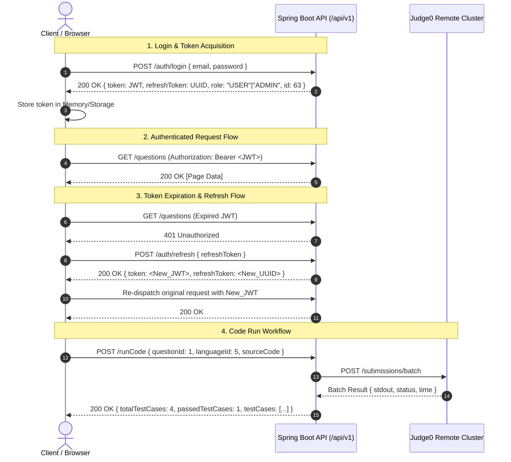

# Connect-2-Code — Central API Documentation

Welcome to the central, authoritative API documentation repository for the **Connect-2-Code** platform.

This directory serves as the primary technical specification and integration guide for all REST endpoints powering the frontend and backend of the Connect-2-Code ecosystem. Future frontend and backend integrations should consult these documents before modifying or adding API interactions.

---

## 1. Documentation Index

The API documentation suite is structured into the following dedicated references:

| Document | Purpose |
| :--- | :--- |
| [**API_REFERENCE.md**](file:///c:/Users/sakha/Desktop/Connect-2-code/docs/api/API_REFERENCE.md) | **Primary Developer Reference**: Complete specifications for all 37 investigated platform endpoints, including HTTP methods, paths, headers, parameter schemas, request/response bodies, frontend callers, and error behaviors. |
| [**API_AUTH_MATRIX.md**](file:///c:/Users/sakha/Desktop/Connect-2-code/docs/api/API_AUTH_MATRIX.md) | **Evidence-Based Authentication Matrix**: Comprehensive test matrix recording observed HTTP status codes for Anonymous, USER, and ADMIN credentials, alongside definitive access classifications (`PUBLIC`, `USER_OR_ADMIN`, `ADMIN_ONLY`, `USER_ONLY`, etc.). |
| [**API_TEST_RESULTS.md**](file:///c:/Users/sakha/Desktop/Connect-2-code/docs/api/API_TEST_RESULTS.md) | **Audit & Execution Report**: Detailed report of live Postman MCP collection runs, live endpoint probing, execution latencies, the Judge0 code execution pipeline, and backend defects uncovered during testing. |
| [**api-inventory.json**](file:///c:/Users/sakha/Desktop/Connect-2-code/docs/api/api-inventory.json) | **Machine-Readable API Inventory**: Structured JSON catalog of all endpoints, parameters, schemas, and test outcomes for CI/CD validation and automated tooling. |

---

## 2. Backend Infrastructure & Base URL Configuration

The platform backend is a Java Spring Boot REST API service connected to a remote Judge0 code execution cluster.

### Base URL Specifications

- **Production / Remote Base URL:**
  ```text
  https://codingplatform-tdt0.onrender.com/api/v1
  ```
- **Local Development / Proxy Path:**
  ```text
  /api/v1
  ```
  In local development, browser network requests target `/api/v1`, which is proxied by Vite (`vite.config.js`) to the remote backend service to prevent CORS policy violations during browser debugging.

### Environment Variable Contract

The frontend API client (`src/core/api/apiClient.ts`) normalizes base URL configuration according to the following precedence:
1. `import.meta.env.VITE_API_BASE_URL` (if configured, whitespace trimmed, trailing slashes removed).
2. If `VITE_API_BASE_URL` is empty or relative (`/api/v1`), it attaches to the window origin.
3. If unspecified in development, defaults to `/api/v1`.

> [!WARNING]
> **Render Cold-Start Latency**: The free-tier Render backend spins down during periods of inactivity. Initial requests after a dormant period can take 30–60 seconds to awaken the container. All automated scripts and clients must configure timeouts of at least 60–120 seconds to prevent premature timeout aborts.

---

## 3. Authentication & Token Architecture

The Connect-2-Code platform utilizes a stateless JSON Web Token (JWT) Bearer authentication architecture paired with long-lived refresh tokens.



### Token Propagation Rules

1. **Authorization Header**: All protected requests require an `Authorization` header formatted as:
   ```http
   Authorization: Bearer <JWT_ACCESS_TOKEN>
   ```
2. **Automatic Token Attachment**: The Axios client in `src/core/api/apiClient.ts` uses a request interceptor to pull the current access token from `tokenStorage` (`src/core/security/tokenStorage.ts`) and append it to all outgoing requests.
3. **Redaction Policy**: **Never** commit, log, or display real JWT access tokens, refresh tokens, passwords, or session cookies in plain text. All logs and audit documentation use sanitized tokens (e.g., `[REDACTED_ACCESS_TOKEN]`).

---

## 4. Postman MCP Integration & Safe Usage

The platform APIs are managed in Postman via the connected **Postman Model Context Protocol (MCP)** server.

### Workspace & Collection Details

- **Postman Workspace**: `JAGADEESH SAKHAMURI's Workspace` (ID: `e2b1ba19-064e-4021-839c-35294e960cf9`)
- **Collection Name**: `CONNECT2CODE - All 32 Platform APIs`
- **Collection UID**: `58775230-41b6471c-396a-41f1-949d-f66ccc83d8e7`

### Safe Usage Guidelines

1. **Collection Scope**: Postman MCP supports collection execution through `runCollection`. Running the collection executes all contained requests and records assertions, response status codes, and execution times.
2. **Variable Substitution**: Use Postman Environment variables (e.g., `{{baseUrl}}`, `{{userToken}}`, `{{adminToken}}`) rather than hardcoding static credentials.
3. **State Preservation**: Tests must avoid mutating shared platform data. Mutation probes should target non-destructive endpoints or use controlled, synthetic identifiers that can be inspected without side effects.
